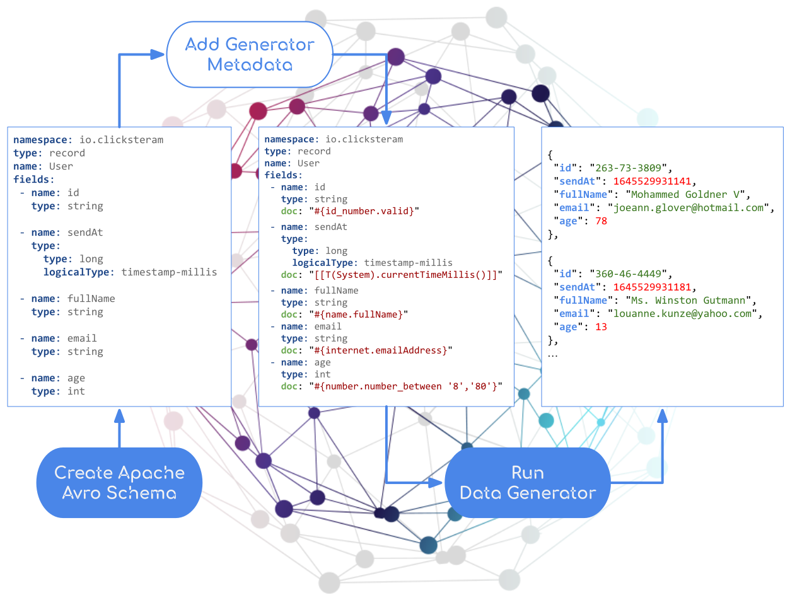

# Data Generator

As we develop data intensive applications we often need realistic datasets for testing them. Datasets that resemble the data as it appears in production. But finding enough real data or creating sufficient volume and variety manually is hard. 

The `DataGenerator` library uses [Apache Avro](https://avro.apache.org/docs/current/) Schemas to generate random and yet realistic datasets, supporting `JSON`, `Avro` and `YAML`  output formats. 

<figure markdown>
  { width="700"} 
</figure>

The Avro Schemas can be annotated with [Faker](https://www.datafaker.net) and [SpEL](https://docs.spring.io/spring-framework/docs/current/reference/html/core.html#expressions) expressions to adapt the generated content for a particular use-case or data model.

## Quick Start

Add the `data-generator` dependency to your project:

```xml
<dependency>
  <groupId>com.logaritex.data</groupId>
  <artifactId>data-generator</artifactId>
  <version>0.0.2-SNAPSHOT</version>
</dependency>
```

Craete an Avro Schema with data Faker and/or SpEL expressions to hint the desired field content:

```yaml title="user.yaml"
namespace: io.simple.clicksteram
type: record
name: User
fields:
  - name: id
    type: string
    doc: "#{id_number.valid}"   # (1)
  - name: sendAt
    type:
      type: long
      logicalType: timestamp-millis
    doc: "[[T(System).currentTimeMillis()]]" # (2)
  - name: fullName
    type: string
    doc: "#{name.fullName}"
  - name: email
    type: string
    doc: "#{internet.emailAddress}"
  - name: age
    type: int
    doc: "#{number.number_between '8','80'}"
```

1. Generate realistic random IDs using the Faker's [IdNumber provider](https://s01.oss.sonatype.org/service/local/repositories/releases/archive/net/datafaker/datafaker/1.1.0/datafaker-1.1.0-javadoc.jar/!/net/datafaker/IdNumber.html).
2. Generate a timestamp (now), using Spring Expression Language (SpEL) to call the Java static method: `#!java java.lang.System.currentTimeMillis()`.

Run the DataGenerator with the user.yaml schema the  generate few data instances:

```java
Iterator<GenericData.Record> iterator = 
    new DataGenerator(
        DataUtil.uriToSchema("file:/user.yaml"), // (1)
        3) //(2)
    .iterator();

while (iterator.hasNext()) {
    System.out.println(iterator.next());
}
```

1. Initialize the generator with the `user.yaml` schema.
2. Number of instances to generate.

the result should look like this:

```json
{ 
  "id": "263-73-3809", 
  "sendAt": 1645529931141, 
  "fullName": "Mohammed Goldner V", 
  "email": "joeann.glover@hotmail.com", 
  "age": 78
},
{ 
  "id": "360-46-4449", 
  "sendAt": 1645529931181, 
  "fullName": "Ms. Winston Gutmann", 
  "email": "louanne.kunze@yahoo.com", 
  "age": 13
}
```

Follow the [usage](./data-generator-usage.md) section for a step-by-step guidelines.

## Features

* Datasets are generated from and validated against well-formed [Apache Avro Schemas](./data-generator-usage.md#avro-schema).
* [Annotate schema fields](./data-generator-usage.md#feild-content-expressions) with [Data Faker](https://www.datafaker.net/usage/) and [Spring Expression Language SpEL](https://docs.spring.io/spring-framework/docs/current/reference/html/core.html#expressions) expressions.
* [Inter-field dependency](./data-generator-usage.md#inter-field-dependencies) - field values in a record can derive from or depend on each other.
* [Instance uniqueness](./data-generator-usage.md#instance-uniqueness) - enforce instance uniqueness based on a selected dataset record field. 
* [Shared dataset values](./data-generator-usage.md#shared-field-values) - allows sharing field values between different datasets.

For full documentation visit [logaritex/data-generator](https://logaritex.github.io/data-generator-docs).
